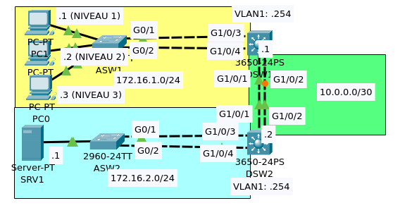

 

<strong>
Mes Projets
</strong>

 

<strong>PRESENTATION DU CONTEXTE</strong>

RisknTic est un centre d’assistance d’informatique basé à Neuilly Plaisance.
L’entreprise a été fondé en 2005 son objectif principale est d’accompagner une société cliente dans la réalisation d’un projet.
RisknTic est une ESN (Entreprise de service du numérique) qui signifie une entreprise spécialisée en services numériques répondant aux besoins
d'externalisation des expertises, des services et des projets informatiques des entreprises.
L'ESN peut par exemple réaliser un logiciel, un site web ou l'exploitation d'une infrastructure informatique.
Il est incontournable pour les entreprises clientes des ESN d’intégrer ces nouvelles technologies afin de se développer rapidement et rester à la
pointe de la technologie.
L’entreprise propose un service de téléassistance en ligne pour aider ses clients à mieux se familiariser avec leurs équipements.
Différentes cellules d’assistance sont mises en place pour gérer les demandes des clients tel que :
* Une assistance réseau
* Une assistance exploitation
* Une assistance micro-informatique

<a href="assets/pdf/ContexteEntreprise.pdf" download="ContexteEntreprise">Cliquez ici pour Télécharger le contexte de l'entreprise</a>

<strong>SCHEMA DE L'INFRASTRUCTURE RESEAU</strong>

<strong>PROJET 1 : Configuration de GLPI et
FusionInventory
</strong>

Le patron de l’entreprise veut ajouter un technicien de gestion du ticketing de niveau 1 pour cela il demande l’ajout d’un poste, les techniciens utilise le logiciel GLPI couplé à FusionInventory pour la gestion des clients, il demande à installer GLPI sur le nouveau poste et de le configurer pour
qu’il ait accès à la base de donnée du serveur.

<a href="assets/pdf/Fiche1.pdf" download="FicheSituation1">Cliquez ici pour Télécharger la Fiche de Situation du Projet 1</a>

<a href="assets/pdf/Projet1.pdf" download="Projet1GLPI">Cliquez ici pour Télécharger la documentation du Projet 1</a>

<strong>PROJET 2 : Configuration EtherChannel
</strong>

Le patron de l'entreprise veut que l’accès à la base de donnée soit accéléré
pour cela il demande à ce qu’un lien d’agrégation soit ajouté entre le Switch 1 lié à l’organisation et le switch 2 lié au serveur.
Nous allons donc installer la nouvelle infrastructure et configurer les liens d'agregation par les protocol LACP et PAgP.

<a href="assets/pdf/Fiche2.pdf" download="FicheSituation1">Cliquez ici pour Télécharger la Fiche de Situation du Projet 2</a>

<a href="assets/pdf/Projet2.pdf" download="Projet2Etherchannel">Cliquez ici pour Télécharger la documentation du Projet 2</a>

