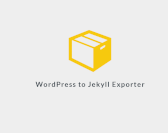
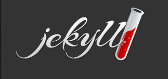
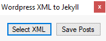
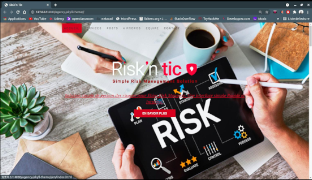
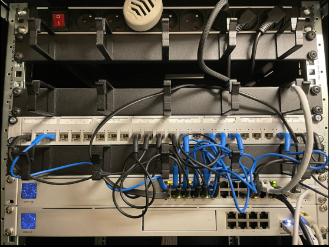
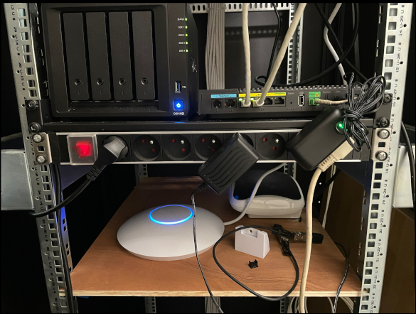

 

<strong>
Les Stages Réalisés
</strong>

 

Lors de mes 2 années d'étude pour le BTS j'ai réalisé deux stages dans des entreprises ce qui m'a permis d'apprendre différentes choses dans le domaine de l'informatique.

Pour ma premiere année j'ai effectué mon stage dans une entreprise qui s'appelle Risk'n Tic et cela m'a permis d'avoir une première expérience dans le domaine.

----------------------------------------------------------------------------------------------------------------------------------------------------------------

Mon rôle et objectif au sein de l'entreprise à été d'exporter un site web de
Wordpress vers Jekyll.
Les sites dynamique sous Wordpress sont utilisés très souvent et composent selon les statistiques près de 40% d'Internet, cependant les sites Wordpress sont beaucoup plus vulnérables et peuvent être plus facilement piratés par rapport à un site statique sous Jekyll.
J'ai donc utilisé plusieurs outils pour réussir cela dont un outil nommé wpXml2Jekyll et puis un autre outil codé en python nommé : exitwp.py

<b>

J'ai aussi effectué différentes taches pour analyser les systèmes d'information.
J'ai même finis par créer une copie de leur site qui était en Wordpress et le refaire avec Jekyll.

<b>

<a href="assets/pdf/note1.pdf" download="Rapport1">Cliquez pour Télécharger le Rapport de stage1</a>

 

----------------------------------------------------------------------------------------------------------------------------------------------------------------

Lors de ma deuxième année j'ai réalisé mon stage dans l'entreprise 21e à Paris.
La société 21E est une entreprise basé dans le 19ème arrondissement de Paris qui propose un service de communication Web et Marketing.
La société collabore avec différentes marques pour leurs proposer des solutions de Design. Cela leurs permet d’améliorer les services de communication digitale des marques et l’image qu’ils renvoient envers tous les types d’utilisateurs.

Lors du stage j'ai :
- mis en place différents matériaux tel que des switchs, un routeur, et un routeur wifi de la marque Ubiquity.
- Configuré les Vlans depuis l'interface unifi d'Ubiquity
- mis à jour différents poste qui étaient sous l'environement Mac.
- réalisé une maquette de la baie informatique pour savoir quelle ports étaient connectés à quelles postes.
- mis à jour un Nas Synology
- mis en place des machine virtuelle pour tester le DSM 6 de Synology

<a href="assets/pdf/note2.pdf" download="Rapport2">Cliquez pour Télécharger le Rapport de stage2</a>

<b>

<b>

