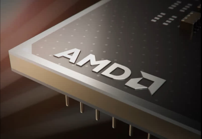
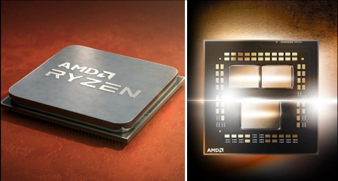
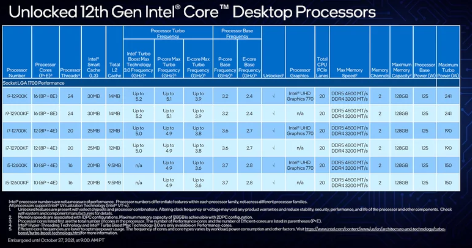
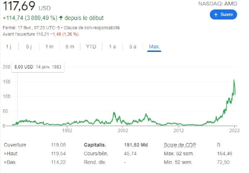
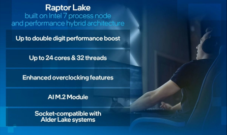

 

<strong>
Ma Veille Technologique
</strong>

<b>
<strong>Qu’est-ce que la veille technologique ? <strong/>

La veille technologique consiste à s'informer de façon systématique sur les techniques les plus récentes et surtout sur leur mise à disposition commerciale. Cette activité met en œuvre des techniques d'acquisition, de stockage et d'analyse d'informations et leur distribution automatique aux différentes sections concernées de l'entreprise, à la manière d'une revue de presse. Ces informations peuvent concerner une matière première, un produit, un composant, un procédé, l'état de l'art et l'évolution de l'environnement scientifique, technique, industriel ou commercial de l'entreprise.

<b>
<strong>Sujet choisi <strong/>

Pour ma veille j'ai choisi comme sujet : 

<strong>"Quelle processeur choisir Entre Intel et AMD ?"</strong>

j'ai choisi ce sujet car j'ai monté mon propre ordinateur il y a quelques années et que j'aime bien faire des configs pour connaitre quelle est le meilleur type de processeur en fonction des usages.
Au cours de ses dernières années l'évolution technologique des processeurs n'a pas cessé de s'améliorer et la vitesse d'execution pour les tâche ne cesse de diminuer, au coeur de cette technologie, deux firmes se démarquent d'une part : Intel et de l'autre AMD.
Nous suivrons leurs évolution tout au long de cette veille pour donner un aperçu de ce combat sans fin.

<b>
<strong>Outils Utilisés <strong/>

Pour suivre les actualités j'ai utilisé plusieurs outils, déjà une application de flux RSS qui s'appelle Feeder qui m'a été le plus utile, car toutes les nouvelles actualités se mettent automatiquement à jour, cela me permet de voir tous les nouveaux articles des différents sites que j'ai pu selectionner.
J'ai aussi suivi des actualités grace à Youtube qui est très utile pour tous les types de sujets.

----------------------------------------------------------------------------------------------------------------------------------------------------------------

<strong>À l’heure, AMD lancera en 2021 son architecture Zen 4 gravée en 5 nm</strong> : Publié le 29/07/2020
Contrairement à Intel, récemment contraint à un report de son procédé de gravure en 7 nm, AMD s'en tient à son planning initial. On apprend notamment que l'architecture Zen 4 du groupe, gravée pour la première fois en 5 nm, arrivera dès l'année prochaine dans nos machines et sur serveurs.
https://www.frandroid.com/marques/amd/743332_a-lheure-amd-lancera-en-2021-son-architecture-zen-4-gravee-en-5-nm

----------------------------------------------------------------------------------------------------------------------------------------------------------------

<strong>11e génération de processeurs Intel Core (Tiger Lake) : architecture graphique Xe et plateforme Evo</strong> : Publié le 02/09/20
Intel a officialisé Tiger Lake, sa 11e génération de processeurs Core pour ordinateurs portables. Cette série jouit d'une partie CPU revue et, surtout, inaugure l'architecture graphique Xe qui promet un gain de performances important.
https://www.lesnumeriques.com/ordinateur-portable/intel-une-11e-generation-de-processeurs-core-qui-met-l-accent-sur-son-architecture-graphique-xe-et-sur-la-plateforme-evo-n153889.html

----------------------------------------------------------------------------------------------------------------------------------------------------------------

<strong>Sortie AMD Ryzen 5 5600X : un processeur parfait pour les joueurs</strong> : Publié le 08/01/21
Avec sa quatrième génération de processeurs Ryzen, AMD enfonce le clou dans le domaine des performances applicatives. Les Ryzen 5000 signent également le retour de la marque sur le devant de la scène en matière de performances vidéoludiques.
https://www.lesnumeriques.com/cpu-processeur/amd-ryzen-5-5600x-p60379/test.html

----------------------------------------------------------------------------------------------------------------------------------------------------------------

<strong>Intel Core de 12e génération : les processeurs hybrides Alder Lake font une entrée fracassante</strong> : Publié le 04/11/21
Intel continue de proposer de nouveaux processeurs à un rythme effréné. Les Core de 12e génération étrennent les puces hybrides d'Intel. Le but avoué de cette série Alder Lake est de redresser la barre à tous les niveaux, et notamment dans les jeux.
https://www.lesnumeriques.com/cpu-processeur/intel-core-de-12e-generation-les-processeurs-hybrides-alder-lake-font-une-entree-fracassante-a170711.html

----------------------------------------------------------------------------------------------------------------------------------------------------------------

<strong>La capitalisation boursière d’AMD a dépassé celle d’Intel pour la première fois</strong> : Publié le 17 février 2022
Une capitalisation momentanément supérieure à celle d’Intel à la suite de l’officialisation du rachat de Xilinx.
Pour la première fois de son histoire, AMD a dépassé – temporairement – Intel sur le plan de la capitalisation boursière. Le 15 février, à la clôture du marché, la capitalisation boursière d’AMD s’élevait à 197,75 milliards de dollars, celle d’Intel à 197,24 milliards de dollars.
https://www.tomshardware.fr/la-capitalisation-boursiere-damd-a-depasse-celle-dintel-pour-la-premiere-fois/

----------------------------------------------------------------------------------------------------------------------------------------------------------------

<strong>Intel 13e génération Raptor Lake : tout ce que vous devez savoir sur les processeurs de nouvelle génération d'Intel</strong> : Publié le 22/02/2022
Les processeurs Raptor Lake, au cas où vous ne le sauriez pas, seront les processeurs Intel de 13e génération. Ils feront essentiellement suite aux processeurs Alder Lake qui dominent actuellement les graphiques de performances. Les processeurs Raptor Lake devraient apporter de meilleures performances avec une conception améliorée de 10 nm.
https://www.xda-developers.com/intel-13th-gen-raptor-lake/

